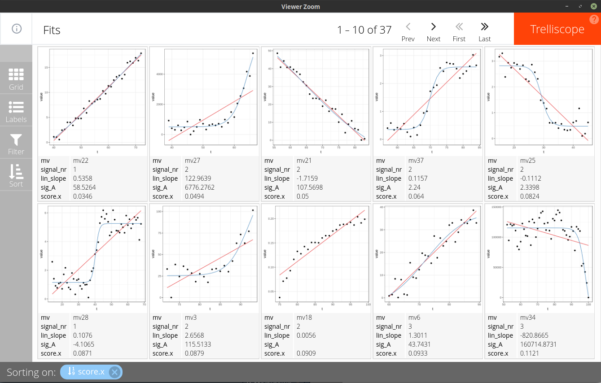

<!-- README.md is generated from README.Rmd. Please edit that file -->

```{r, echo = FALSE}
knitr::opts_chunk$set(
  collapse = TRUE,
  comment = "#>",
  fig.path = "README-"
)
```

# mbte.vis

[]()
[](https://travis-ci.org/mkerschbaumer/mbte.vis)


The goal of mbte is to combine the
[mbte](https://mkerschbaumer.github.io/mbte)-package
with the [trelliscopejs](https://github.com/hafen/trelliscopejs)-package.
The package is mainly intended to visualize fits created by the mbte-package.
Using *trend modules* provided in this package, trends can be detected and
filtered by model coefficients.

## Installation

You can install mbte.vis from github with:

```{r gh-installation, eval = FALSE}
devtools::install_github("mkerschbaumer/mbte.vis")
```

## Example

```{r message=FALSE}
# Load example dataset from mbte-package
library(mbte)
library(mbte.vis)
library(dplyr)
data(filtered_signals)
```

Detect linear and logistic trends using trend modules:

```{r warning=FALSE}
fits <- mbte_coef_fit(
  filtered_signals,
  lin = tm_linear(),
  sig = tm_logistic()
)

fits
```

Compute error metric for each fit (to sort fits later on):

```{r}
# compute normalized root mean squared error
nrmse <- function(pred, obs) {
  sqrt(mean((pred - obs)^2)) / (max(obs) - min(obs))
}

# compute minimum score for each (sub)signal - see mbte package
metrics <- fits %>%
  mbte_compute_metrics(nrmse = nrmse(.pred, .obs)) %>% 
  group_by(mv, signal_nr) %>%
  summarise(score = min(result, na.rm = TRUE))
metrics
```

Join the fitted signals with the computed scores:

```{r}
combined <- fits %>%
  left_join(metrics, by = c("mv", "signal_nr")) %>%
  mbte_reconstruct(fits) # currently needed to preserve needed attributes
combined
```

The table above can be visualized via the trelliscopejs package using the
following wrapper function:

```{r eval=FALSE, warning=FALSE}
mbte_visualize_coef(combined, mv, signal_nr)
```

Trelliscopejs allows to filter/sort the data to visualize. In this
example, sorting by the score in ascending order is applied. A low error score
indicates, that a trend module was able to generalize the underlying trend:


